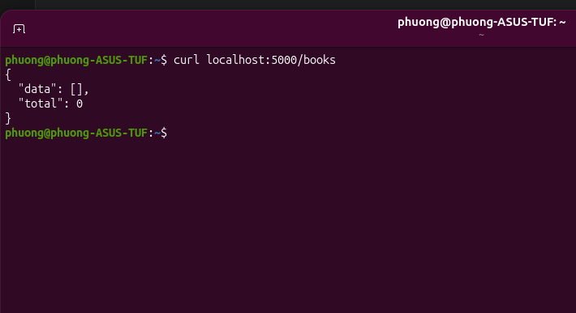
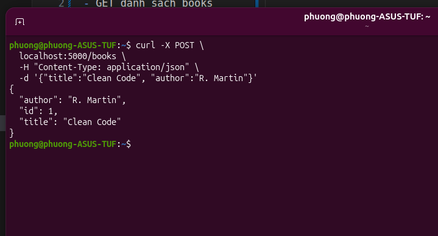
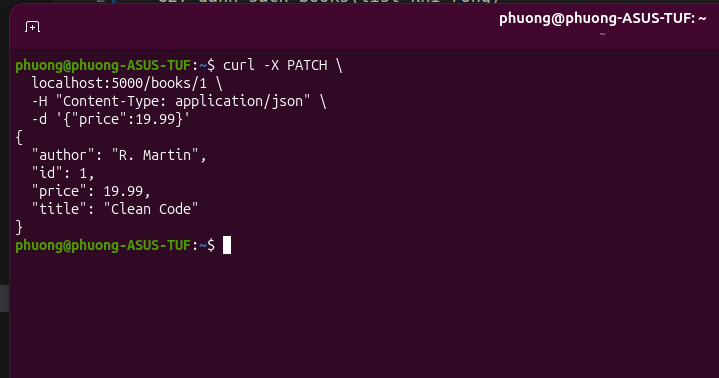
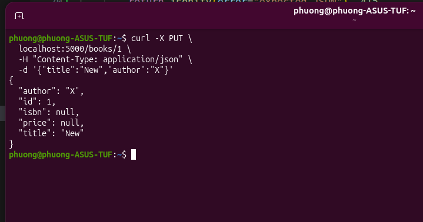
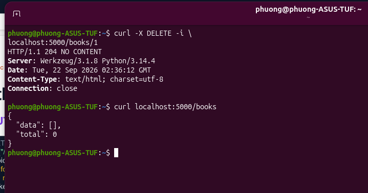
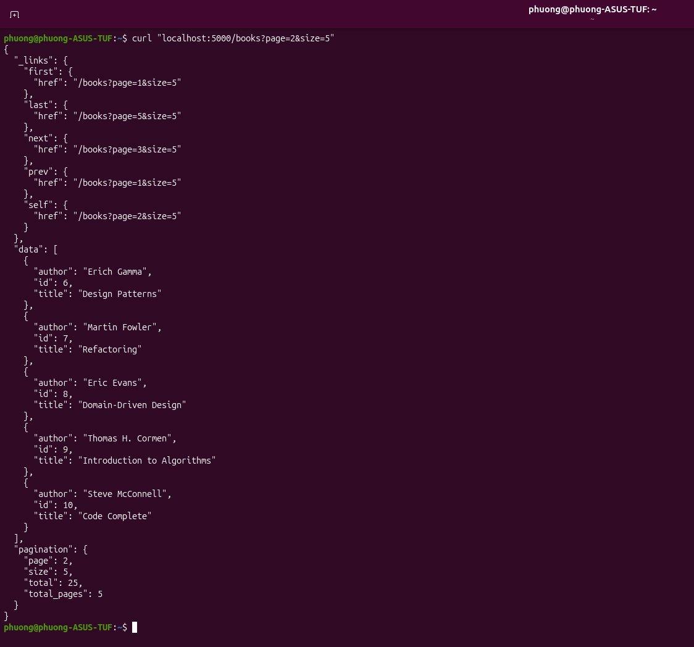
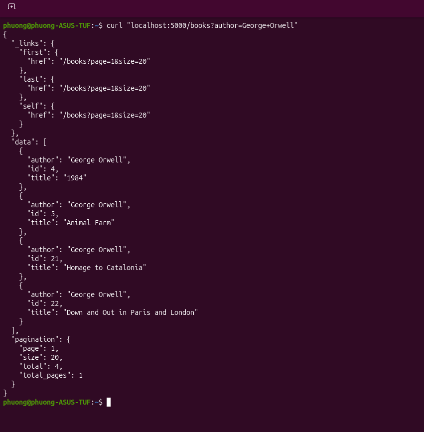
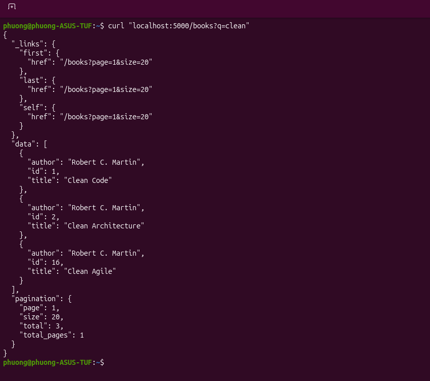

App1
- GET danh sách books(list khi rỗng)

- POST tạo cuốn sách mới 

- POST thiếu field

- POST thiếu Content-Type

App2
- PATCH sửa một field

- PUT thay thế toàn bộ

- DELETE một book bằng id

App3
- GET book list với phân trang

- Tìm kiếm theo tên tác giả

- Tìm kiếm theo title

