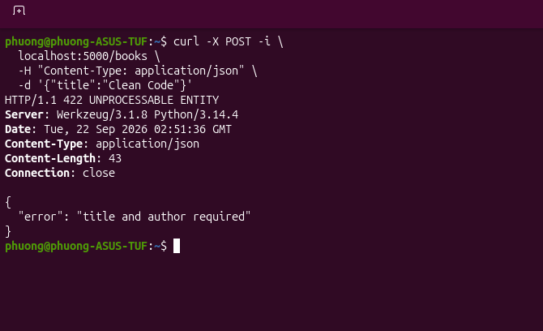
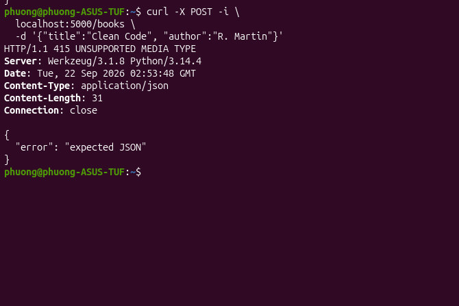
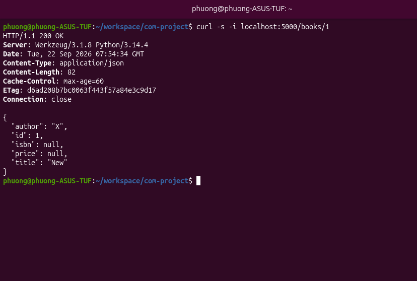
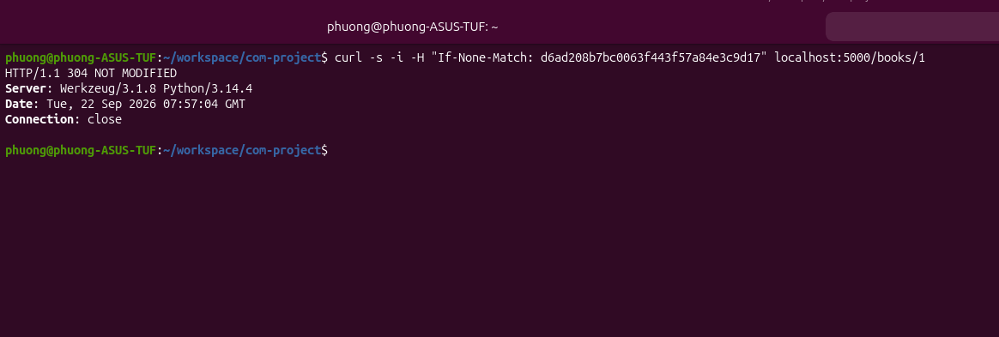
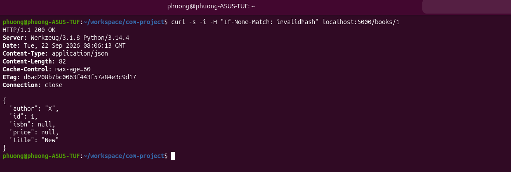

# Lab thực hành tại lớp
## App 1: 

- **GET danh sách books (list khi rỗng)**
  
  

- **POST tạo cuốn sách mới**
  
  

- **POST thiếu field (Test lỗi 422)**
  
  

- **POST thiếu Content-Type (Test lỗi 415)**
  
  

---

## App 2: 

- **PATCH sửa một field**
  
  

- **PUT thay thế toàn bộ**
  
  

- **DELETE một book bằng id**
  
  

---

## App 3: 

- **GET book list với phân trang**
  
  

- **Tìm kiếm theo tên tác giả**
  
  

- **Tìm kiếm theo title**
  
  

---

# BTVN 1 SQLite + Etag (week2/hw/app.py)
- GET /books/<id> trả về ETag + Hỗ trợ If-None-Match trả 304. 
- Hash theo nội dung object, lưu trong field Etag trong DB. 
- Case 1: Gọi API lần đầu, nhận về ETag.

- Case 2: Gọi API lần 2 với ETag

- Case 3: Gọi API với ETag sai (hoặc bị cũ) -> Trả về new data

# BÀI TẬP 2 – AUDIT GITHUB REST API

## 1. Tổng quan

- **API:** GitHub REST API
- **Base URL:** `https://api.github.com`
- **Kiểu API:** REST
- **Format:** JSON
- **Authentication:** Không bắt buộc khi truy cập dữ liệu public.
- **API Version:** Có thể chỉ định bằng header `X-GitHub-Api-Version`.
- **Official Documentation:** https://docs.github.com/en/rest

GitHub REST API được version hóa. Version hiện tại là `2026-03-10`. GitHub cũng cung cấp OpenAPI description chính thức cho REST API. 

---

## 2. Audit 5 endpoints

### 1. Get a user

- **Endpoint:** `GET /users/{username}`
- **Method:** `GET`
- **Chức năng:** Lấy thông tin public của một GitHub user. VD: username, tên, company và số lượng repository.
- **Status code chính:**
  - `200 OK`: Lấy thông tin user thành công.
  - `404 Not Found`: Không tìm thấy user.
- **Headers chính:**
  - `Accept`: Xác định format dữ liệu client muốn nhận. GitHub khuyến nghị `application/vnd.github+json`.
  - `X-GitHub-Api-Version`: Xác định version của GitHub REST API.
  - `X-RateLimit-Limit`: Phục vụ cho rate limiting. Số request tối đa trong rate-limit window.
  - `X-RateLimit-Remaining`: Số request còn lại trong window.
- **RESTful:** Có. Resource `user` được xác định bằng URI và truy xuất bằng `GET`.
- **Official docs:** https://docs.github.com/en/rest/users/users

### 2. List repositories for a user

- **Endpoint:** `GET /users/{username}/repos`
- **Method:** `GET`
- **Chức năng:** Lấy danh sách các repository public của một user.
- **Status code chính:**
  - `200 OK`: Request thành công.
- **Headers chính:**
  - `Accept`: Xác định format response.
  - `X-GitHub-Api-Version`: Xác định version API.
  - `X-RateLimit-Limit`: Giới hạn request.
  - `X-RateLimit-Remaining`: Số request còn lại.
  - `Link`: Chứa thông tin về các trang kết quả khác khi response được phân trang.
- **RESTful:** Có. Resource collection `repos` được truy xuất bằng `GET`.
- **Official docs:** https://docs.github.com/en/rest/repos/repos

### 3. Get a repository

- **Endpoint:** `GET /repos/{owner}/{repo}`
- **Method:** `GET`
- **Chức năng:** Lấy thông tin của một repository như tên, owner, description, stars, forks,...
- **Status code chính:**
  - `200 OK`: Repository tồn tại.
  - `301 Moved Permanently`: Repository đã được chuyển.
  - `403 Forbidden`: Không được phép truy cập.
  - `404 Not Found`: Không tìm thấy repository.
- **Headers chính:**
  - `Accept`: Xác định format response.
  - `X-GitHub-Api-Version`: Xác định version API.
  - `X-RateLimit-Limit`: Giới hạn request.
  - `X-RateLimit-Remaining`: Số request còn lại.
- **RESTful:** Có. Repository là một resource được xác định bằng URI `/repos/{owner}/{repo}`.
- **Official docs:** https://docs.github.com/en/rest/repos/repos

### 4. List repository issues

- **Endpoint:** `GET /repos/{owner}/{repo}/issues`
- **Method:** `GET`
- **Chức năng:** Lấy danh sách issue của một repository.
- **Status code chính:**
  - `200 OK`: Request thành công.
  - `301 Moved Permanently`: Repository đã được chuyển.
  - `404 Not Found`: Không tìm thấy resource.
  - `422 Unprocessable Content`: Request không hợp lệ hoặc validation thất bại.
- **Headers chính:**
  - `Accept`: Xác định format response.
  - `X-GitHub-Api-Version`: Xác định version API.
  - `X-RateLimit-Limit`: Giới hạn request.
  - `X-RateLimit-Remaining`: Số request còn lại.
  - `Link`: Hỗ trợ pagination.
- **RESTful:** Có. Issues là một resource collection được truy xuất bằng `GET`.
- **Official docs:** https://docs.github.com/en/rest/issues/issues

### 5. List repository languages

- **Endpoint:** `GET /repos/{owner}/{repo}/languages`
- **Method:** `GET`
- **Chức năng:** Lấy thống kê các ngôn ngữ lập trình được sử dụng trong repository.
- **Status code chính:**
  - `200 OK`: Request thành công.
- **Headers chính:**
  - `Accept`: Xác định format response.
  - `X-GitHub-Api-Version`: Xác định version API.
  - `X-RateLimit-Limit`: Giới hạn request.
  - `X-RateLimit-Remaining`: Số request còn lại.
- **RESTful:** Có. Languages được truy xuất như một resource liên quan tới repository.
- **Official docs:** https://docs.github.com/en/rest/repos/repos

---

## 3. Đánh giá các ràng buộc REST

Có thể đánh giá GitHub REST API dựa trên 6 ràng buộc của REST:

| REST constraint | GitHub REST API |
|---|---|
| **Client–Server** | Đạt |
| **Stateless** | Đạt |
| **Cacheable** | Đạt |
| **Uniform Interface** | Đạt |
| **Layered System** | Đạt |
| **Code-on-Demand** | Không |

### 1. Client–Server

Client gửi HTTP request đến GitHub server để truy cập hoặc thay đổi resource. Client và server có vai trò tách biệt.

### 2. Stateless

Mỗi request chứa các thông tin cần thiết để server xử lý có thế bao gồm URI, HTTP method, headers và authentication theo contract của Github nếu cần. Github server không yêu cầu và duy trì session của client giữa các request.

### 3. Cacheable

GitHub hỗ trợ conditional requests thông qua `ETag` và `Last-Modified`. Client có thể sử dụng các giá trị này để kiểm tra resource có thay đổi hay không; nếu không thay đổi, server có thể trả `304 Not Modified`. :contentReference[oaicite:2]{index=2}

### 4. Uniform Interface

GitHub sử dụng URI để định danh resource, HTTP methods để thao tác với resource, HTTP status codes để biểu diễn kết quả và JSON để biểu diễn resource. GitHub cũng cung cấp các header và representation thống nhất cho REST API. 

### 5. Layered System

Client ở đây chỉ gọi API và nhận về kết quả. Client không cần biết request được xử lý trực tiếp bởi GitHub hay thông qua các thành phần trung gian như proxy, gateway hoặc load balancer.
### 6. Code-on-Demand

GitHub REST API chủ yếu trả về dữ liệu và không yêu cầu client tải code thực thi từ server. Tuy nhiên, Code-on-Demand là constraint tùy chọn nên việc không sử dụng không làm API mất tính REST.

---

## 4. Kết luận

5 endpoint được phân tích đều thể hiện rõ các đặc trưng REST: sử dụng URI để xác định resource, HTTP methods để thao tác, HTTP status codes để biểu diễn kết quả và JSON để trao đổi dữ liệu.

Xét theo 6 REST constraints, GitHub REST API thể hiện 5/5 ràng buộc cốt lõi, trong đó Code-on-Demand là ràng buộc tùy chọn và không được sử dụng.

**Kết luận: GitHub REST API có tính RESTful rõ ràng và phù hợp để được xem là một REST API.**
