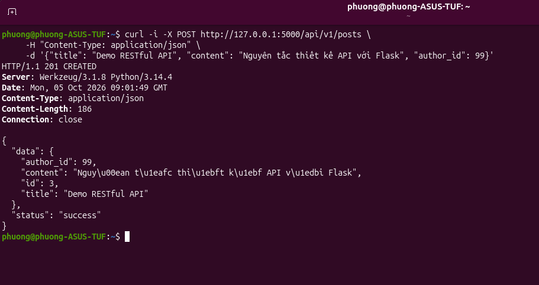
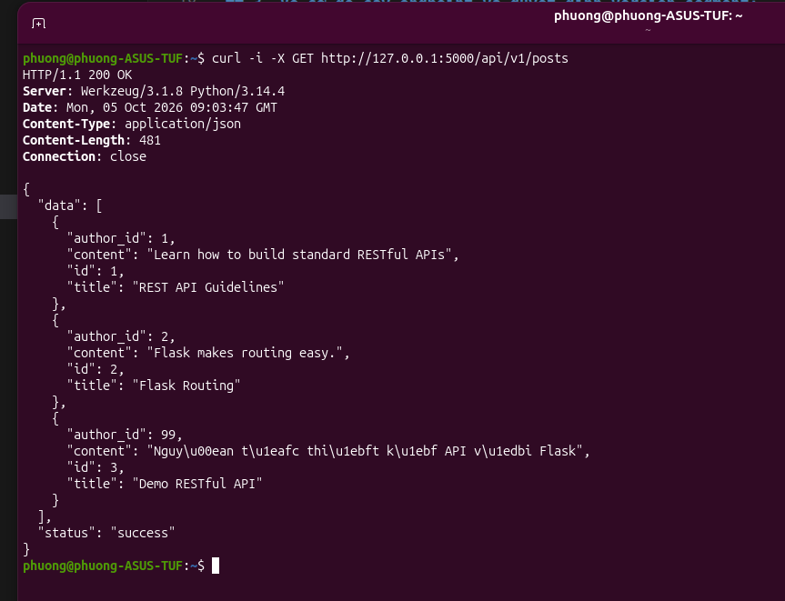
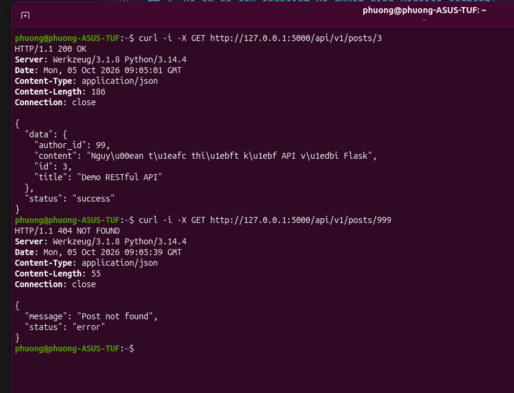
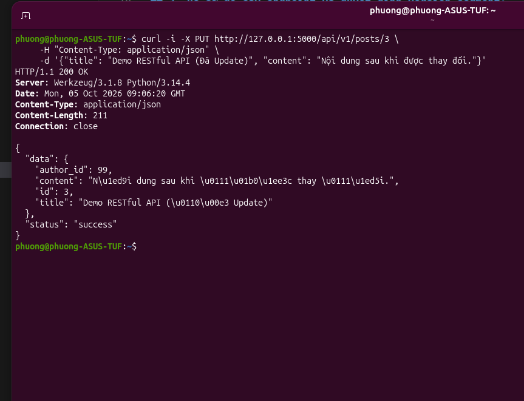
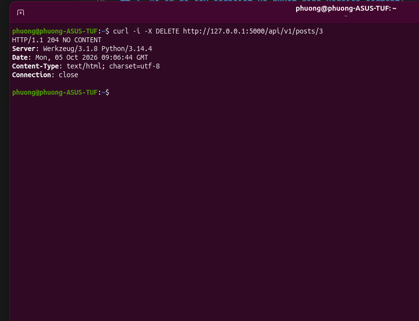

# THIẾT KẾ RESOURCE CHO BLOG API

## 1. Xác định resources trong miền:
- **Users** (Người dùng)
- **Posts** (Bài viết)
- **Comments** (Bình luận)
- **Tags** (Thẻ)

## 2. Phân loại collection / item / sub-resource:
- **Collection:** `/users`, `/posts`, `/tags`
- **Item:** `/users/{id}`, `/posts/{id}`, `/tags/{id}`
- **Sub-resource:** 
  - `/posts/{id}/comments` (Bình luận của bài viết)
  - `/posts/{id}/tags` (Thẻ của bài viết)
  - `/users/{id}/followers` (Người theo dõi user)
  - `/users/{id}/following` (Người user đang theo dõi)

## 3. Vẽ sơ đồ cây endpoint và quyết định version segment:
- **Version segment:** `/api/v1`
- **Sơ đồ:**
```text
/api/v1
├── /users
│   └── /{user_id}
│       ├── /followers
│       └── /following
├── /posts
│   ├── (GET, POST)
│   └── /{post_id}
│       ├── (GET, PUT, PATCH, DELETE)
│       ├── /comments
│       │   ├── (GET, POST)
│       │   └── /{comment_id}
│       │       └── (PUT, DELETE)
│       └── /tags
└── /tags
    └── /{tag_id}
```

## 4. Triển khai cho collections /posts

1. Create tài nguyên


2. Lấy danh sách tài nguyên


3. Lấy chi tiết một tài nguyên


4. Update tài nguyên


5. Delete tài nguyên

