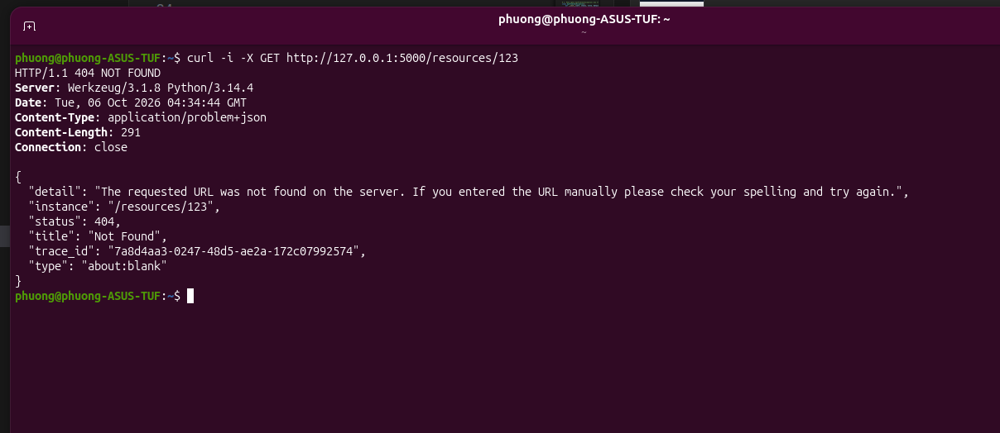
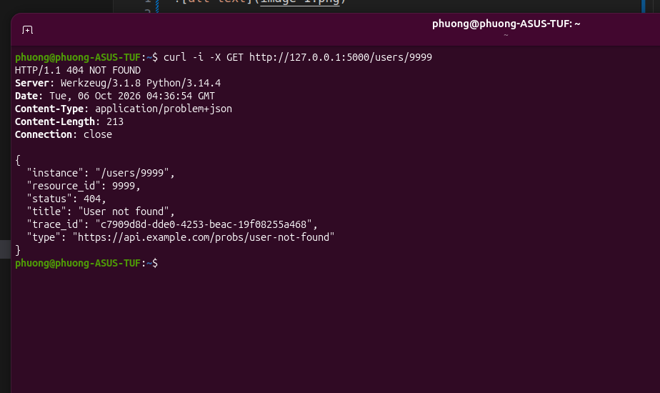
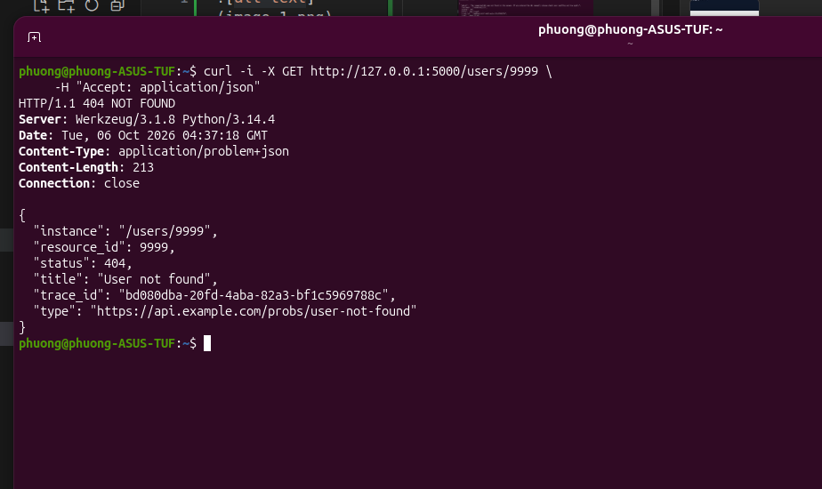
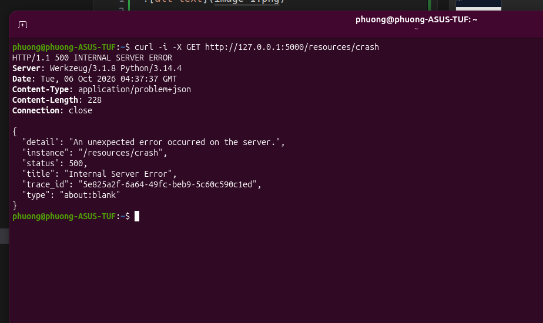

- Request tới /resources/{id} trả 404, body có type/title/detail/status/instance, không lộ stack trace.

- Thiếu header Accept, vẫn trả problem+json cho lỗi API.

-Truyền header Accept báo chỉ nhận application/json, vẫn trả problem+json cho lỗi API.

- Gặp exception chưa bắt, trả 500 với message tính và log server-side
